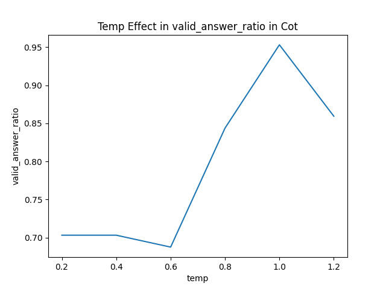

# Sentiment Classification
## Purpose & Assumptions
The goal of this project is to showcase how causal small language models (SLMs) can be used as text classifiers using different prompting techniques. Instead of simulating an enterprise-level problem, it tries to demonstrate different approaches with small-scale data and high-level assumptions. These assumptions can be found below:
* The data source is fully representative of real-world applications; in other words, there are no distribution shifts or different use cases.
* Due to a lack of descriptions in the data, the meaning of data points and utility will be inferred with limited knowledge.

Data, Experiments, Hyperparam tuning, Final Result, Code execution
## Data
The data is used from [link](https://huggingface.co/datasets/ajaykarthick/imdb-movie-reviews). It is sampled equally, with both negative and positive examples being the same number. Before deep diving into prompt iterations, here are some observations about the data
### Reviews
User texts or reviews are generally written informally; however, there are some HTML tags &lt;br>, &lt;/br> for formatting. Another observation is that some reviews contain overly used punctuations, such as '.....' or '!!!', to amplify emotions."
### Labels and Data Analysis
Labels are recorded as 0 and 1; however, there is no formal indication of what they actually mean. However, after reading some reviews and comparing their labels, negative reviews about movies are recorded as 1, and positive ones as 0. A small difference can be seen in word frequencies, which is calculated by removing tags, punctuations, and performing lemmatization.


The frequencies look similar; however, the critical word 'bad' is more frequent in Label 1. Therefore, Label 1 is assumed to represent negative sentiment.

Another dimension to consider is the length of the review.


It seems there is no significant difference between positive and negative examples in terms of length.

#### Cluster Analysis
Lastly, it would be a good idea to visualize the semantic difference between reviews, because there might be imbalances within the data. In order to visualize the semantic difference in the data, Sentence-BERT + DBSCAN is used to produce the following plots. You can find the implementation in the data_analysis notebook.


Based on the clustering, there are 16 different cluster labels. 


### Data split 
For evaluation sets and experiments, two things are considered:

* Budget: Running LLMs during experimentation is time-consuming, so we need small and large validation sets for quick iterations.
* Data Coverage: The cluster analysis shows that there are semantic differences in the training data. Therefore, the selection must cover semantic differences as well as label balance. 

For creating validation set(s); If random sampling is used, There will be trade-off between data coverage and budget. Instead of random sampling, we assume that each examples from different clusters have same value. As a result, Stratified sampling is applied based on label and cluster labels, and 4 different sized datasets are generated from the training data:

* Mini Validation Set: 64 examples with balanced labels and stratified sampling over cluster labels for hyperparameter search
* Small Validation Set: 128 examples with balanced labels and stratified sampling over cluster labels.
* Big Validation Set: 512 examples with balanced labels.
* Small In-Context Set: 128 examples.
* Big In-Context Set: 512 examples.
Small sets are used for fast experimentation, big sets are used for second validation.

For final testing (holdout):
* Test Set: 256 examples from the test set.

## Experimentation
In this section, prompt iteration steps and their performance will be demonstrated. During prompt iterations, base generation parameters are selected to ensure fairness across instructions. These base parameters are: temperature: 0.2, top_p: 0.95, top_k: 40, and min_p: 0.05. The reason for the low temperature is that during prompt iteration, models should perform less stochastically. However, keeping top_p and top_k relatively normal allows the model to consider different tokens. The context length is decided based on the prompting technique.

To extend and keep track of prompt iterations, a base class experiment is created. This class enables templating prompts, calling LLMs, and parsing results.

For evaluation metrics; accuracy is generally go to metric for balanced classification, however checking precision, recall and f1_scores for checking quality of predictions based on FN and FP. Since trade-off between FN and FP is unknown go to metric will be f1_score. Another metric is valid answer ratio, valid answer ratio is measurement of percentage of llms can produce meaningfull reponse by following instruction. The reason we have a guard rail any scores can be calculated based on valid answers. Moreover, it gives some idea of LLMs stability.

For simplicity every experiment is using below function for formating responses
```
def parse_response(self,response: dict) -> int:
        try:
            content = response['choices'][0]['message']['content'].lower()
        except Exception:
            print("parse error")
            return -1
        
        if 'positive' in content: # equality check instead
            return 0
        elif 'negative' in content:
            return 1
        else:
            return -1 # missing case 
```
this function is produced emprically.
 
### Simple Prompt Experiment
This experiment covers prompts in the experiments/simple_prompt_experiment.py. The big model (1.5B) performed very well on test set, see below confusion matrix


f1_score is around 0.89 and valid_answer_ratio 1.0

However when we run small model the accuracy is degregates. See below confusion matrix


f1_score drops to around 0.8, valid_answer_ratio is 0.96 on small validation set. In addition, due to capacity of small models instruction following, the valid answers also drops, prompts starts to response out of instruction. Instead of giving asked answer positive or negative, sometimes it produces invalid answers like explaining the text or additional information. However, valid answer ratio is around 95% for this case which it can be acceptable. In the later sections, invalid answer cases will be adressed. Other experiments are conducted on small model because initial model have good accuracy. 

#### HyperParams (Temp and MinP)
Another hyptohesis is tuning hyperparameres like temparature and min_p for text generation. Why not top_k and top_p, there are two reasons for using only min_p, first reason is top_k static parameter in which hard to optimize in budget setting. top_p is cumulative therefore it doens't enforce probability cap for next token i.e. long tail cases. However min_p enforces this cap regarless of number of tokens can be produced. Search spaces are created as follows, temperature search space is set to wide range of setting, however min_p search space is set to make model produce to less variaty of tokens. The reason for this setting is we are trying to produce a two selected tokens. Considering more tokens less effective than smaller set of tokens.

Below figures shows best temperature and min_p values for this experiment


### Validation
After setting best temp and min_p values, see confusion matrix on test set


f1_score is around 0.75, and valid answer ratio 0.99

### FewShot Prompt Experiment
Another technique that can be applied to improve prompt performance is the few-shot technique. In this version, some examples are introduced from the in-context examples (see the data section) to familiarize the model with the problem and solution. Initially, 5 and 10 examples are used in the prompt.

##### Prompt with 5 examples

##### Prompt with 10 examples


Few-Shot Prompting seems to have a bias towards positive answers. Therefore, using the logit_bias parameter can be useful. A small search on logit_bias for the token 'Positive' achieved a more balanced generation. Please check the exp_fewshot notebook for implementation details. For the token id, 35490 bias term is set -100

Prompt with 10 examples takes longer than Prompt with 5 examples, therefore prompt with 5 examples is used for remaining of the experiment.

#### HyperParams (Temp and MinP)
By using same methodology in the previous prompt.

##### F1 vs Temp


##### Valid Answer Ratio vs Temp


Best temparature value for debiased model is 0.3 and minP is 0.05 And running validation on testset f1_score is 0.78 and valid answer ratio is 0.89
See below confusion matrix for test run.


### ChainOfThoughts(CoT) Experiment

The lastly CoT is used. Base result for CoT, with default parameters


It shows good performance however with f1_score=0.85, but it has very low valid answer ratio = 0.7. First check effect of temp to f1 and valid answer ratio

#### F1 vs Temp


#### Valid Answer Ratio vs Temp


When some responses are looked, model stuck repeting same words or sentences again and again. In order to prevent this, repeat_penalty parameter can be tuned. See below for different configurations for repeat penalty [1.0,1.1, 1.2, 1,5,2.0,3.0]

#### F1 vs Repeat Penalty


#### Valid Answer Ratio vs Repeat Penalty


Based on those results, best f1 score is chosen when temp=0.4. or another alternative is more balanced result when temp=1.0. However, due to very low valid answer ratio, balanced setting is chosen. See below test performance for Best f1_score settings, with f1_score 0.81; and valid answer ratio 0.70; 


Test f1_score 0.78 and valid answer ratio is 0.79

One observation is that when increasing repeat_penalty, f1 is affected heavily but there is increase in valid answer ratio. 

### Overall Results

The best f1 is coming from CoT prompt. However, it generates non valid answers. On the other hand, simple prompt using small looks robusts in terms of performance and accuracy. But, overall greatest potential is few shot prompt but it requires more carefull design. 

### Final Thoughts

In this exercise, different prompting methods are covered. Here are some final thoughts about them:

* Bigger models are more capable, especially in instruction following. This is a great advantage, as a simple, thoughtful prompt can yield very good results quickly.
* A lack of instruction-following capabilities can produce unwanted results. There are some ways to mitigate these, such as stacked generations (calling different models sequentially) and best-of-N runs. However, these techniques are computationally expensive in my local setting due to running multiple generations, leading to higher compute time, etc.
* Small models have inherent biases, and it is important to keep that in mind.
* Experiments can take a longer time due to hyperparameter search. Parallelization is a good way to proceed. Maybe using gpus or different backend might help vLLM. 
* Although models are small, inference speeds are generally slow (maybe in my setup). Another point is randomness. Running experiments back to back leads different results. 
* Last but not least, during experimentation few shot learning getting close to very best. However it wasn't stable enough to report those results. It might achieve very good performance with high number of few  shot examples and careful hyper parameter tuning.


